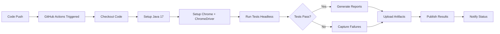

# 🚀 Selenium Automation Testing Project


## 📋 Table of Contents
- [Overview](#-overview)
- [Tech Stack](#-tech-stack)
- [Prerequisites](#-prerequisites)
- [Installation](#-installation)
- [Project Structure](#-project-structure)
- [Configuration](#-configuration)
- [Running Tests Locally](#-running-tests-locally)
- [CI/CD Setup](#-cicd-setup)
- [Test Reports](#-test-reports)
- [Troubleshooting](#-troubleshooting)
- [Contributing](#-contributing)

---

## 🎯 Overview

A comprehensive Selenium WebDriver automation testing framework built with Java, Gradle, and TestNG. This framework provides:

✅ **Automated Browser Testing** - Chrome and Firefox support  
✅ **CI/CD Integration** - GitHub Actions for automated testing  
✅ **Multiple Environments** - Staging, Production configs  
✅ **Page Object Model** - Clean, maintainable test architecture  
✅ **Detailed Reports** - HTML test reports with screenshots  
✅ **Headless Execution** - For CI/CD environments  
✅ **Parallel Testing** - Faster test execution  

**Test Site**: [SauceDemo](https://www.saucedemo.com/)

---

## 💻 Tech Stack

| Technology | Version | Purpose |
|------------|---------|---------|
| **Java** | 17 | Programming language |
| **Selenium WebDriver** | 4.35.0 | Browser automation |
| **TestNG** | 7.10.2 | Test framework |
| **Gradle** | 8.5 | Build automation |
| **WebDriverManager** | 6.3.2 | Automatic driver management |
| **Log4j2** | 2.25.1 | Logging framework |
| **AssertJ** | 3.27.3 | Fluent assertions |
| **GitHub Actions** | - | CI/CD pipeline |

---

## 📦 Prerequisites

### Required Software

#### 1. Java JDK 17 or higher
```bash
# Check Java version
java -version

# Should output: openjdk version "17.x.x" or higher
```
**Download**: [Eclipse Temurin JDK 17](https://adoptium.net/)

#### 2. Google Chrome Browser (Latest Stable)
```bash
# Check Chrome version (macOS)
google-chrome --version

# Check Chrome version (Linux)
google-chrome-stable --version

# Check Chrome version (Windows)
"C:\Program Files\Google\Chrome\Application\chrome.exe" --version
```
**Download**: [Google Chrome](https://www.google.com/chrome/)

#### 3. Git
```bash
# Check Git version
git --version
```
**Download**: [Git](https://git-scm.com/downloads)

#### 4. IDE (Recommended)
- **IntelliJ IDEA** (recommended) or **Eclipse**

---

## 🚀 Installation

### Step 1: Clone the Repository
```bash
git clone https://github.com/kerjabarengrizki/repo-qa.git
cd repo-qa
```

### Step 2: Verify Gradle Wrapper
The project includes Gradle wrapper, so you don't need to install Gradle separately.

```bash
# macOS/Linux - Make gradlew executable
chmod +x gradlew

# Verify gradlew works
./gradlew --version
```

**Windows users**: Use `gradlew.bat` instead of `./gradlew`

### Step 3: Download Dependencies
```bash
# Download all project dependencies
./gradlew build --refresh-dependencies

# Or just download without running tests
./gradlew clean build -x test
```

### Step 4: Verify Installation
```bash
# Check if everything compiles
./gradlew clean compileJava compileTestJava

# You should see: BUILD SUCCESSFUL
```

### Step 5: Open in IDE
```bash
# IntelliJ IDEA
# File → Open → Select repo-qa folder

# Eclipse
# File → Import → Existing Gradle Project
```

---

## 📁 Project Structure

```
repo-qa/
├── .github/
│   └── workflows/
│       └── ci.yml                          # ⚙️ GitHub Actions CI/CD pipeline
│
├── src/
│   ├── main/java/org/example/
│   │   ├── core/
│   │   │   └── BasePage.java               # Base page object class
│   │   └── login/
│   │       ├── LoginPage.java              # Login page objects
│   │       ├── HomePage.java               # Home page objects
│   │       └── Transaction.java            # Transaction page objects
│   │
│   └── test/
│       ├── java/
│       │   ├── core/
│       │   │   ├── BaseTest.java           # 🔧 Base test configuration
│       │       ├── DriverManager.java      # 🔧 WebDriver management
│       │       ├── ConfigReader.java       # 🔧 Environment configs
│       │       ├── TestListener.java       # Test event listener
│       │       └── TestUtils.java          # Utility functions
│       │   └── saucedemo/
│       │       ├── login/
│       │       │   └── LoginTest.java      # Login test cases
│       │       ├── home/
│       │       │   └── HomePageTest.java   # Home page tests
│       │       └── transaction/
│       │           └── TransactionTest.java # Transaction tests
│       │
│       └── resources/
│           ├── config/
│           │   └── staging.properties      # 🔧 Environment configuration
│           └── suites/
│               └── smoke.xml               # 🔧 TestNG test suite
│
├── build.gradle.kts                        # 🔧 Gradle build script
├── settings.gradle.kts                     # Gradle settings
├── gradlew                                 # ⚙️ Gradle wrapper (Unix/macOS)
├── gradlew.bat                             # ⚙️ Gradle wrapper (Windows)
├── CI_TROUBLESHOOTING.md                   # 📖 Troubleshooting guide
└── README.md                               # 📖 This file
```

**Legend:**  
🔧 Configuration files | ⚙️ System files | 📖 Documentation

---

## ⚙️ Configuration

### 1. Environment Configuration

**File**: `src/test/resources/config/staging.properties`

```properties
baseUrl=https://www.saucedemo.com/
standardUser=standard_user
password=secret_sauce
failedUser=locked_out_user
firstName=John
lastName=Doe
postalCode=12345
```

**How it works:**
- Environment is selected via `-Penv=staging` parameter
- If no environment specified, defaults to `staging`
- ConfigReader loads properties at runtime

**To add new environment:**
1. Create `src/test/resources/config/{env-name}.properties`
2. Add configuration values
3. Run with `-Penv={env-name}`

---

### 2. Test Suite Configuration

**File**: `src/test/resources/suites/smoke.xml`

```xml
<!DOCTYPE suite SYSTEM "https://testng.org/testng-1.0.dtd">
<suite name="SmokeTestSuite" verbose="1">
    <parameter name="browser" value="chrome"/>
    <test name="LoginTests">
        <groups>
            <run>
                <include name="smoke"/>
            </run>
        </groups>
        <classes>
            <class name="saucedemo.login.LoginTest"/>
        </classes>
    </test>
</suite>
```

**Important**: 
- ⚠️ `browser` parameter must be set to `chrome` for CI/CD
- Use `firefox` only if running locally with Firefox installed
- Group tests using `@Test(groups = {"smoke"})`

---

## 🏃 Running Tests Locally

### Option 1: Run All Tests (Smoke Suite)

```bash
# Run with default suite (smoke.xml) and staging environment
./gradlew clean test

# Explicit suite and environment
./gradlew clean test -Psuite=smoke.xml -Penv=staging
```

### Option 2: Run Specific Test Suite

```bash
# If you have multiple suites
./gradlew clean test -Psuite=regression.xml -Penv=staging
```

### Option 3: Run from IDE

**IntelliJ IDEA:**
1. Right-click on `smoke.xml` → Run
2. Or right-click on any test class → Run
3. Or right-click on test method → Run

**Eclipse:**
1. Right-click on `smoke.xml` → Run As → TestNG Suite
2. Or right-click on test class → Run As → TestNG Test

### Option 4: Run Specific Test Class

```bash
./gradlew test --tests saucedemo.login.LoginTest
```

### Option 5: Run with Different Browser (Local Only)

Edit `smoke.xml` and change browser parameter:
```xml
<parameter name="browser" value="firefox"/>
```

Then run:
```bash
./gradlew clean test
```

---

## 🤖 CI/CD Setup

### GitHub Actions (Already Configured ✅)

The CI/CD pipeline is **already set up** in `.github/workflows/ci.yml` and will:

✅ **Automatically trigger** on:
- Push to `main`, `master`, or `develop` branches
- Pull requests to these branches
- Manual workflow dispatch

✅ **Automated steps:**
1. Checkout code from repository
2. Validate Gradle wrapper
3. Set up Java 17 (Temurin distribution)
4. Install Chrome browser (latest stable)
5. Download matching ChromeDriver
6. Run tests in headless mode
7. Generate HTML test reports
8. Upload test reports as artifacts
9. Publish test results with GitHub annotations

### Viewing CI/CD Results

#### 1. **Actions Tab**
Visit: `https://github.com/kerjabarengrizki/repo-qa/actions`

You'll see:
- ✅ Successful runs (green checkmark)
- ❌ Failed runs (red X)
- ⏳ Running workflows (yellow dot)

#### 2. **Workflow Details**
Click on any workflow run to see:
- **Summary**: Overall status and duration
- **Jobs**: Individual job execution logs
- **Artifacts**: Downloadable test reports

#### 3. **Test Reports**
After workflow completes:
1. Go to workflow run page
2. Scroll to **Artifacts** section
3. Download `test-reports-smoke.xml`
4. Extract and open `index.html` in browser

#### 4. **Test Results Annotations**
- Test failures appear as GitHub annotations
- Visible in **Files changed** tab of pull requests
- Shows exactly which tests failed and why

---

## 📊 Test Reports

### Local Test Reports

After running tests locally:

```bash
# Run tests
./gradlew clean test

# Reports are generated at:
# - HTML Report: build/reports/tests/test/index.html
# - XML Results: build/test-results/test/*.xml
```

**View HTML report:**
```bash
# macOS
open build/reports/tests/test/index.html

# Linux
xdg-open build/reports/tests/test/index.html

# Windows
start build/reports/tests/test/index.html
```

### CI Test Reports

**Download from GitHub Actions:**
1. Go to: `https://github.com/kerjabarengrizki/repo-qa/actions`
2. Click on workflow run
3. Scroll to **Artifacts** section
4. Download `test-reports-smoke.xml`
5. Extract and open `index.html`

**Report includes:**
- ✅ Total tests executed
- ✅ Pass/Fail/Skip counts
- ✅ Execution time per test
- ✅ Detailed error messages
- ✅ Stack traces for failures

---

## 🔧 CI/CD Advanced Configuration

### Customize Test Suites in CI

Edit `.github/workflows/ci.yml`:

```yaml
strategy:
  matrix:
    suite: [smoke.xml, regression.xml]  # Add more suites
```

### Run on Different Branches

```yaml
on:
  push:
    branches:
      - main
      - develop
      - feature/*  # Add feature branches
```

### Add Environment Variables

```yaml
- name: Run tests with Gradle
  run: ./gradlew clean test -Psuite=${{ matrix.suite }} -Penv=staging
  env:
    GITHUB_ACTIONS: true
    CHROME_BIN: /usr/bin/google-chrome
    CUSTOM_VAR: your_value  # Add custom variables
```

### Schedule Tests (Cron)

Add to workflow file:

```yaml
on:
  schedule:
    - cron: '0 2 * * *'  # Run daily at 2 AM UTC
```

### Parallel Test Execution

```yaml
strategy:
  matrix:
    suite: [smoke.xml, regression.xml]
    os: [ubuntu-latest, windows-latest]  # Run on multiple OS
```

---

## 🐛 Troubleshooting

### Common Issues

#### 1. **Tests fail with SessionNotCreatedException**

**Cause**: Browser/driver version mismatch

**Solution**:
```bash
# Clear Gradle cache
./gradlew clean --no-daemon

# Verify Chrome is installed
google-chrome --version

# Check smoke.xml has browser="chrome"
cat src/test/resources/suites/smoke.xml
```

#### 2. **Gradlew permission denied (macOS/Linux)**

**Solution**:
```bash
chmod +x gradlew
./gradlew clean build
```

#### 3. **CI tests pass locally but fail in GitHub Actions**

**Cause**: Environment differences

**Check**:
- Verify `smoke.xml` has `browser="chrome"` (not firefox)
- Ensure `GITHUB_ACTIONS=true` env var is set
- Check test doesn't depend on local files

#### 4. **No test reports generated**

**Solution**:
```bash
# Ensure test task completed
./gradlew clean test --info

# Check reports directory
ls -la build/reports/tests/test/
```

#### 5. **Gradle build fails**

**Solution**:
```bash
# Clean build
./gradlew clean

# Rebuild with dependencies
./gradlew build --refresh-dependencies

# Check Java version
java -version  # Should be 17+
```

### Getting Help

📖 **Full troubleshooting guide**: See `CI_TROUBLESHOOTING.md`

🔍 **Check CI logs**: https://github.com/kerjabarengrizki/repo-qa/actions

💬 **GitHub Issues**: Report bugs and request features

---

## 📋 Quick Command Reference

```bash
# Installation
git clone https://github.com/kerjabarengrizki/repo-qa.git
cd repo-qa
chmod +x gradlew
./gradlew build

# Run Tests
./gradlew clean test                              # Default (smoke.xml, staging)
./gradlew clean test -Psuite=smoke.xml            # Specific suite
./gradlew clean test -Penv=staging                # Specific environment
./gradlew test --tests LoginTest                  # Specific test class

# Build & Compile
./gradlew clean                                   # Clean build artifacts
./gradlew build                                   # Build project
./gradlew build -x test                           # Build without tests
./gradlew compileJava compileTestJava             # Compile only

# Reports
./gradlew clean test
open build/reports/tests/test/index.html          # View report (macOS)

# Debugging
./gradlew clean test --info                       # Verbose output
./gradlew clean test --stacktrace                 # Show stack traces
./gradlew clean test --debug > test.log 2>&1      # Full debug log

# Gradle
./gradlew --version                               # Check Gradle version
./gradlew tasks                                   # List available tasks
./gradlew dependencies                            # Show dependencies
```

---

## 🎯 CI/CD Workflow Examples

### Example 1: Push to Main Branch

```bash
# Make changes
git add .
git commit -m "Add new test case"
git push origin main

# GitHub Actions automatically:
# 1. Detects push to main
# 2. Starts CI workflow
# 3. Runs smoke.xml tests
# 4. Publishes results
# 5. Uploads artifacts
```

**Monitor**: https://github.com/kerjabarengrizki/repo-qa/actions

### Example 2: Pull Request

```bash
# Create feature branch
git checkout -b feature/new-test
# Make changes
git add .
git commit -m "Add checkout test"
git push origin feature/new-test

# Create PR on GitHub
# → CI runs automatically
# → Results appear in PR checks
```

### Example 3: Manual Trigger

1. Go to: https://github.com/kerjabarengrizki/repo-qa/actions
2. Click **CI - Automation Tests** workflow
3. Click **Run workflow** button
4. Select branch
5. Click **Run workflow**

### Example 4: Scheduled Run

Already configured to run on cron schedule (if enabled):
```yaml
schedule:
  - cron: '0 0 * * *'  # Daily at midnight UTC
```

---

## 🔄 CI/CD Pipeline Flow



### Pipeline Stages

| Stage | Description | Duration |
|-------|-------------|----------|
| **Checkout** | Clone repository | ~5s |
| **Setup Java** | Install JDK 17 + cache | ~15s |
| **Setup Chrome** | Install browser + driver | ~30s |
| **Compile** | Build project | ~20s |
| **Test** | Execute test suite | ~45s |
| **Report** | Generate & upload | ~10s |
| **Total** | Average pipeline time | **~2 min** |

---

## 📚 Best Practices

### Writing Tests

```java
// ✅ Good: Use Page Object Model
@Test(groups = {"smoke"})
public void testLogin() {
    LoginPage loginPage = new LoginPage(driver);
    loginPage.login(username, password);
    assertTrue(loginPage.isLoginSuccessful());
}

// ❌ Bad: Direct WebDriver calls in test
@Test
public void testLogin() {
    driver.findElement(By.id("username")).sendKeys(username);
    driver.findElement(By.id("password")).sendKeys(password);
    // ...
}
```

### Test Organization

```java
// Use descriptive test names
@Test(groups = {"smoke", "login"}, priority = 1)
public void verifyLoginWithValidCredentials() {
    // Test implementation
}

// Add meaningful descriptions
@Test(description = "Verify user can login with standard credentials")
public void testStandardUserLogin() {
    // Test implementation
}
```

### Environment Management

```java
// ✅ Good: Use ConfigReader
String baseUrl = config.getProperty("baseUrl");
String username = config.getProperty("standardUser");

// ❌ Bad: Hardcoded values
String baseUrl = "https://www.saucedemo.com/";
String username = "standard_user";
```

---

## 🤝 Contributing

### How to Contribute

1. **Fork the repository**
   ```bash
   # Click 'Fork' button on GitHub
   git clone https://github.com/YOUR_USERNAME/repo-qa.git
   ```

2. **Create a feature branch**
   ```bash
   git checkout -b feature/amazing-feature
   ```

3. **Make your changes**
   - Add new tests
   - Fix bugs
   - Improve documentation

4. **Commit your changes**
   ```bash
   git add .
   git commit -m "Add: amazing feature description"
   ```

5. **Push to your fork**
   ```bash
   git push origin feature/amazing-feature
   ```

6. **Create Pull Request**
   - Go to original repository
   - Click "New Pull Request"
   - Select your feature branch
   - Describe your changes
   - Submit PR

### Commit Message Guidelines

```bash
# Format: <type>: <description>

# Types:
Add:    # New feature or test
Fix:    # Bug fix
Update: # Update existing code
Docs:   # Documentation changes
Refactor: # Code refactoring
Test:   # Add or update tests
CI:     # CI/CD changes

# Examples:
git commit -m "Add: checkout test for guest user"
git commit -m "Fix: login page object selector"
git commit -m "Update: Chrome options for headless mode"
git commit -m "Docs: add installation instructions"
```

### Code Review Checklist

- [ ] Tests pass locally (`./gradlew clean test`)
- [ ] Tests pass in CI (check Actions tab)
- [ ] Code follows project structure (Page Object Model)
- [ ] New tests added to appropriate test suite
- [ ] Configuration externalized (not hardcoded)
- [ ] Meaningful test and method names
- [ ] Comments added for complex logic
- [ ] No merge conflicts

---

## 📞 Support & Contact

### Resources

📖 **Documentation**
- Main README: [You're reading it!]
- Troubleshooting: [CI_TROUBLESHOOTING.md](CI_TROUBLESHOOTING.md)
- CI/CD Setup: [.github/workflows/ci.yml](.github/workflows/ci.yml)

🔗 **Links**
- Repository: https://github.com/kerjabarengrizki/repo-qa
- CI/CD Pipeline: https://github.com/kerjabarengrizki/repo-qa/actions
- Issues: https://github.com/kerjabarengrizki/repo-qa/issues

📚 **External Resources**
- [Selenium Documentation](https://www.selenium.dev/documentation/)
- [TestNG Documentation](https://testng.org/doc/documentation-main.html)
- [Gradle User Guide](https://docs.gradle.org/current/userguide/userguide.html)
- [GitHub Actions Docs](https://docs.github.com/en/actions)

### Getting Help

1. **Check documentation first**
   - Read this README
   - Check CI_TROUBLESHOOTING.md
   - Review CI workflow logs

2. **Search existing issues**
   - https://github.com/kerjabarengrizki/repo-qa/issues

3. **Create new issue**
   - Describe the problem
   - Include error messages
   - Attach screenshots/logs
   - Specify environment (OS, Java version, etc.)

4. **Contact maintainers**
   - Open GitHub issue
   - Tag with appropriate label (bug, question, enhancement)

---

## 📝 License

This project is for educational and testing purposes.

---

## 🎉 Quick Start Summary

```bash
# 1. Clone and setup
git clone https://github.com/kerjabarengrizki/repo-qa.git
cd repo-qa
chmod +x gradlew

# 2. Install dependencies
./gradlew build --refresh-dependencies

# 3. Run tests locally
./gradlew clean test

# 4. View report
open build/reports/tests/test/index.html

# 5. Push changes (triggers CI automatically)
git add .
git commit -m "Your changes"
git push origin main

# 6. Monitor CI
# Visit: https://github.com/kerjabarengrizki/repo-qa/actions
```

---

## ⭐ Project Status


**Last Updated**: December 14, 2025  
**Status**: ✅ Active Development  
**CI/CD**: ✅ Fully Configured  

---

<div align="center">

### 🚀 Happy Testing! 🎯

**Built with ❤️ using Selenium + TestNG + Gradle + GitHub Actions**

[⬆ Back to Top](#-selenium-automation-testing-project)

</div>
    }
}
```

**How to modify:**
- Add new dependencies in the `dependencies` block
- Change default test suite in `tasks.test` block

---

### 3. **Environment Configuration**

#### `src/test/resources/config/staging.properties`
**Purpose**: Contains environment-specific settings (URLs, credentials, test data)

**Current Configuration:**
```properties
baseUrl=https://demo.nopcommerce.com/login
username=bruno@gmail.com
password=admin123
failedUser=locked_out_user
firstName=John
lastName=Doe
postalCode=12345
```

**How to add new environments:**
1. Create new file: `production.properties`, `qa.properties`, etc.
2. Use `-Penv=production` to switch environments

---

### 4. **Test Suite Configuration**

#### `src/test/resources/suites/smoke.xml`
**Purpose**: TestNG suite file that defines which tests to run

**Example Configuration:**
```xml
<!DOCTYPE suite SYSTEM "https://testng.org/testng-1.0.dtd">
<suite name="Smoke Test Suite" parallel="false" thread-count="1">
    <test name="Smoke Tests">
        <groups>
            <run>
                <include name="smoke"/>
            </run>
        </groups>
        <packages>
            <package name="saucedemo.*"/>
            <package name="nopcommerce"/>
        </packages>
    </test>
</suite>
```

**How to create new suites:**
1. Create new XML file in `src/test/resources/suites/`
2. Run with: `./gradlew test -Psuite=your-suite.xml`

---

### 5. **WebDriver Configuration**

#### `src/test/java/core/DriverManager.java`
**Purpose**: Manages WebDriver instances with Cloudflare bypass and CI/CD support

**Key Features:**
```java
// Cloudflare bypass options
options.addArguments("--disable-blink-features=AutomationControlled");
options.addArguments("--user-agent=Mozilla/5.0...");
options.setExperimentalOption("useAutomationExtension", false);

// GitHub Actions detection (headless mode)
String githubActions = System.getenv("GITHUB_ACTIONS");
if (githubActions != null && githubActions.equals("true")) {
    options.addArguments("--headless=new");
    options.addArguments("--no-sandbox");
    options.addArguments("--disable-dev-shm-usage");
}
```

**What you can modify:**
- Browser options
- Headless mode settings
- User agent strings
- Timeouts and window size

---

### 6. **Base Test Configuration**

#### `src/test/java/core/BaseTest.java`
**Purpose**: Base class for all test classes with setup/teardown

**Key Methods:**
```java
@BeforeSuite
public void loadConfig() {
    // Loads environment config (staging, production, etc.)
}

@BeforeTest
public void setUp(@Optional("chrome") String browser) {
    // Initializes WebDriver, maximizes window, navigates to baseUrl
}

@AfterTest
public void tearDown() {
    // Closes browser and cleans up
}
```

---

## 🏃 Running Tests Locally

### Run Default Test Suite (smoke.xml)
```bash
./gradlew clean test
```

### Run Specific Test Suite
```bash
./gradlew clean test -Psuite=smoke.xml
```

### Run with Different Environment
```bash
./gradlew clean test -Psuite=smoke.xml -Penv=staging
```

### Run in Headless Mode (Simulating CI)
```bash
# macOS/Linux
export GITHUB_ACTIONS=true
./gradlew clean test -Psuite=smoke.xml

# Windows
set GITHUB_ACTIONS=true
gradlew clean test -Psuite=smoke.xml
```

### Run Specific Test Class
```bash
./gradlew test --tests "saucedemo.login.LoginTest"
```

### Run with Detailed Logging
```bash
./gradlew clean test -Psuite=smoke.xml --info
```

---

## 🔄 CI/CD Setup

### Setting Up GitHub Actions

#### Step 1: Ensure Required Files Exist
Verify these files are committed to your repository:
```bash
# Must have execute permissions
✅ gradlew
✅ gradlew.bat
✅ .github/workflows/ci.yml
✅ src/test/resources/suites/smoke.xml
✅ src/test/resources/config/staging.properties
```

#### Step 2: Commit and Push to GitHub
```bash
# Initialize git (if not already done)
git init

# Add all files
git add .

# Commit
git commit -m "Add CI/CD configuration"

# Add remote repository
git remote add origin https://github.com/YOUR_USERNAME/YOUR_REPO_NAME.git

# Push to main branch
git push -u origin main
```

#### Step 3: Verify Workflow
1. Go to your GitHub repository
2. Click on **"Actions"** tab
3. You should see the workflow "CI - Automation Tests" running
4. Click on the workflow run to see real-time logs

#### Step 4: Download Test Reports
After the workflow completes:
1. Click on the completed workflow run
2. Scroll down to **"Artifacts"** section
3. Download `test-reports-smoke.xml` and `test-results-smoke.xml`
4. Extract and open `index.html` for detailed test reports

---

## 📊 Test Reports

### Local Test Reports

After running tests locally, view the HTML report:

```bash
# macOS
open build/reports/tests/test/index.html

# Linux
xdg-open build/reports/tests/test/index.html

# Windows
start build/reports/tests/test/index.html
```

### CI Test Reports

Test reports are automatically uploaded as artifacts in GitHub Actions:
- **HTML Reports**: `build/reports/tests/test/`
- **XML Results**: `build/test-results/test/*.xml`
- **Retention**: 30 days

---

## 🛠️ Troubleshooting

### 1. **Permission Denied: gradlew**
```bash
# Fix: Make gradlew executable
chmod +x gradlew

# Or regenerate wrapper
gradle wrapper --gradle-version=8.5
```

### 2. **Chrome Driver Not Found**
The project uses WebDriverManager which automatically downloads ChromeDriver. If issues persist:
```bash
# Clear cache and redownload
rm -rf ~/.cache/selenium
./gradlew clean test
```

### 3. **Tests Fail in CI but Pass Locally**
- Check if elements need more wait time in headless mode
- Verify window size is sufficient: `--window-size=1920,1080`
- Add explicit waits in page objects
- Check test reports in GitHub Actions artifacts

### 4. **Cloudflare Blocking Tests**
The `DriverManager` includes Cloudflare bypass options. If still blocked:
- Increase Thread.sleep delays
- Add more realistic user interactions
- Use explicit waits instead of Thread.sleep
- Check if the website has additional bot protection

### 5. **Out of Memory in CI**
```kotlin
// Add to build.gradle.kts
tasks.test {
    maxHeapSize = "1g"
    jvmArgs = listOf("-Xmx1g")
}
```

### 6. **TestNG Suite Not Found**
Verify the suite file path:
```bash
# Check file exists
ls -la src/test/resources/suites/smoke.xml

# Verify path in build.gradle.kts matches
suiteXmlFiles = listOf(file("src/test/resources/suites/$suite"))
```

---

## 📝 Additional Resources

- [GitHub Actions Workflow Documentation](.github/workflows/README.md)
- [Selenium WebDriver Docs](https://www.selenium.dev/documentation/)
- [TestNG Documentation](https://testng.org/doc/documentation-main.html)
- [Gradle User Manual](https://docs.gradle.org/current/userguide/userguide.html)

---

## 🤝 Contributing

1. Fork the repository
2. Create a feature branch: `git checkout -b feature/your-feature`
3. Make your changes
4. Run tests locally: `./gradlew clean test`
5. Commit changes: `git commit -m "Add your feature"`
6. Push to branch: `git push origin feature/your-feature`
7. Submit a pull request

---

## 📄 License
MIT License

---

## 📧 Contact

For questions or issues, please open an issue on GitHub.

---

**Note**: 
- Replace `YOUR_USERNAME` and `YOUR_REPO_NAME` in the badge URL and git commands with your actual GitHub username and repository name.
- Update the contact section with your information.

